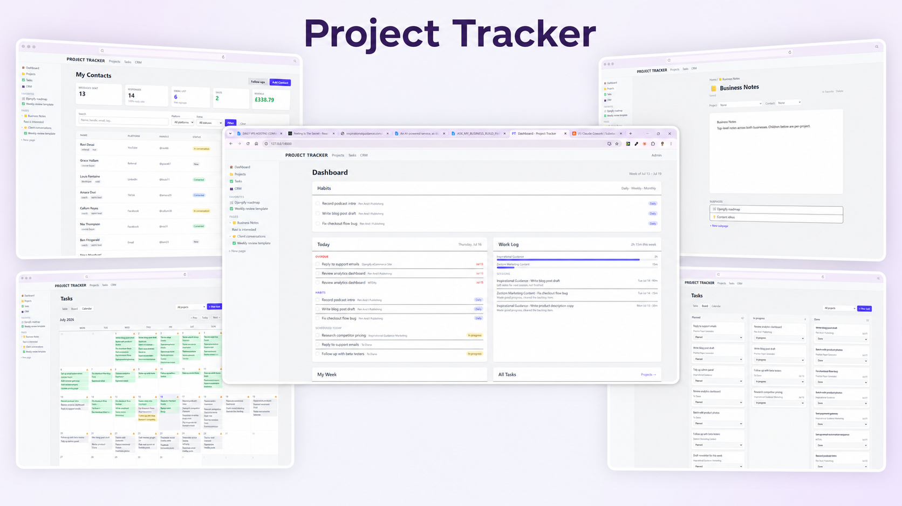

# Tracker NOW OLD TURNED INTO PRODUCT TRACKER

A self-hosted workspace for running multiple small businesses at once  

Built with Django. No SaaS subscription, no third-party accounts, your data
stays in your own SQLite file. Runs as a normal web app or as a packaged
desktop app (`.exe`).

---

<H1>NO LONGER IN USE</H1> 

---

## Stack

- Django 5.2, Django REST Framework
- SQLite (single file)
- Tailwind CSS v4 (`@tailwindcss/cli`, no Node build framework) + a little
  vanilla JS/`fetch` — no front-end framework
- AI SDKs: `openai`, `anthropic`, `google-genai`; keys encrypted with
  `cryptography` (Fernet)
- `mcp` (Model Context Protocol) for the Claude Desktop server
- Gunicorn + WhiteNoise for server deployments; PyWebView + Waitress +
  PyInstaller for the packaged desktop `.exe`

---
 

 
