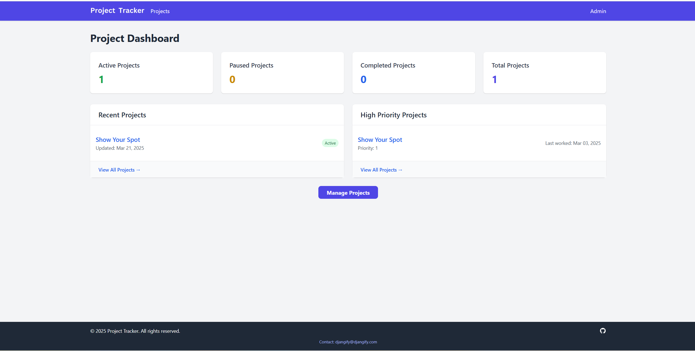

# Project Tracker

A Django-based project management system to track and manage multiple projects, tasks, and work sessions. 

<br><br>

I used Claude.ai to help me build this project. I knew what I wanted but didn't want to spend the next few days coding. 

It look less than 10 hours to complete and it was working and ready to use.

Right now I am only using this in local development. I may deploy it at some stage but that isn't urgent right now.

## Features

- Track projects with status (active, paused, completed) and priority
- Manage tasks for each project
- Log work sessions to monitor time spent on projects
- Customizable site configuration including branding and social media
- REST API for integration with other systems
- Responsive UI using Tailwind CSS
- Social media sharing with customizable metadata

## Project Structure

The application follows a clean Django project structure:

- `config/`: Main Django configuration (settings, urls, wsgi, asgi)
- `core/`: Shared functionality, homepage, and site-wide utilities
- `projects/`: Project management app with models and views
- `templates/`: Project-wide templates
- `static/`: Static files (CSS, JS, images)
- `media/`: User-uploaded content (project images, site branding)

## Components

### Core App
- Abstract base models like `TimeStampedModel`
- Site configuration with customizable branding
- Utility functions and template tags
- Global context processor for site settings

### Projects App
- Models for Projects, Tasks, and Work Sessions
- List and detail views for projects
- Status filtering and sorting
- REST API endpoints

## Setup

### Prerequisites

- Python 3.8+
- MariaDB/MySQL (or SQLite for development)
- pip

### Installation

1. Clone the repository:
```bash
git clone https://github.com/your-username/project-tracker.git
cd project-tracker
```

2. Create a virtual environment:
```bash
python -m venv venv
source venv/bin/activate  # On Windows: venv\Scripts\activate
```

3. Install dependencies:
```bash
pip install -r requirements.txt
```

4. Create a `.env` file with your environment settings:
```
SECRET_KEY=your-secret-key
DB_NAME=project_tracker
DB_USER=your_db_user
DB_PASSWORD=your_db_password
DB_HOST=localhost
DB_PORT=3306
```

5. Run migrations:
```bash
python manage.py migrate
```

6. Create a superuser:
```bash
python manage.py createsuperuser
```

7. Run the development server:
```bash
python manage.py runserver
```

8. Visit http://localhost:8000 in your browser and log in to the admin at http://localhost:8000/admin/

### Image Specifications

For the site configuration, these are the recommended image sizes:

- **Logo**: 120-200px wide by 32-40px tall (SVG format recommended)
- **Favicon**: 32x32px (PNG format)
- **Social Media Image**: 1200x630px (JPG or PNG format)

## Deployment

### cPanel Deployment

1. Upload the project to your cPanel hosting account
2. Create a MySQL/MariaDB database
3. Update the `.env` file with production settings
4. Make sure the `passenger_wsgi.py` file is in the project root
5. Configure the domain to point to the project directory

## API Endpoints

The application provides a REST API for projects, tasks, and work sessions:

- `/projects/api/projects/` - Project management
- `/projects/api/tasks/` - Task management
- `/projects/api/sessions/` - Work session management

## License

MIT

## Final Thoughts

This project tracker was created with software for one in mind. 
As a concept, software for one, refers to software designed for a single user, either in terms of:

- **Personal Software**: Apps or tools meant for individual use (e.g., journaling apps, personal finance trackers, self-hosted dashboards like this project tracker, tools like my news aggregator).
- **Solo development projects**: Software created by a single developer for their own use, often without concern for scalability or team collaboration.
- **Customised automation**: Scripts or apps built to streamline a single person's workflow, like Python scripts for organizing files or tracking habits.

Developer : Diane Corriette
<br>
https://www.djangify.com 